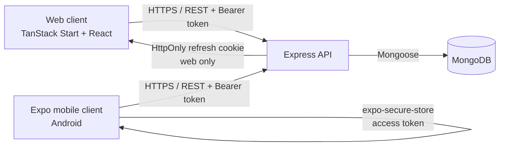
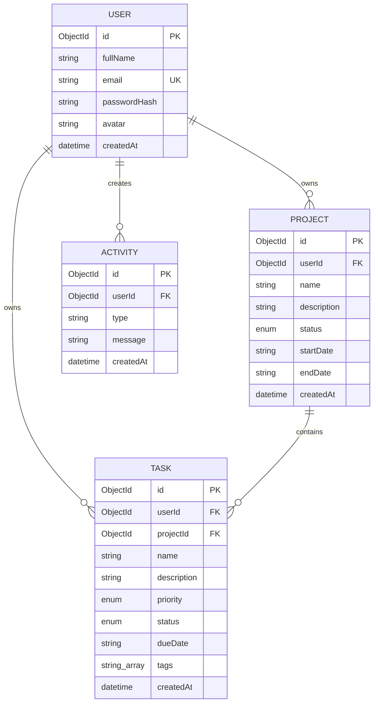

# KRAM


KRAM is a full-stack project-management workspace. A single account can be used from the responsive web app and the Expo Android app; both clients read and write the same Express API and MongoDB database.

It supports project and task CRUD, progress tracking, dashboard analytics, activity history, search and filters, user settings, and secure JWT-based authentication.

> **Implementation note:** the assessment brief specifies PostgreSQL or MySQL. This submission currently uses MongoDB with Mongoose. The model and ownership relationships are documented below, but migrating to a relational database is still required for strict compliance with that requirement.

## Contents

- [Architecture](#architecture)
- [Features](#features)
- [Technology](#technology)
- [Repository structure](#repository-structure)
- [Quick start](#quick-start)
- [Configuration](#configuration)
- [How to use KRAM](#how-to-use-kram)
- [Mobile app](#mobile-app)
- [API reference](#api-reference)
- [Data model](#data-model)
- [Security](#security)
- [Testing and quality checks](#testing-and-quality-checks)
- [Deployment](#deployment)

## Architecture



### Request and state flow

1. A user registers or logs in through either client.
2. The API validates input, hashes passwords with bcrypt, and issues a short-lived access JWT. For the web app, it also stores a refresh token in an HttpOnly cookie.
3. Clients send `Authorization: Bearer <access-token>` to protected endpoints.
4. Authentication middleware derives the user ID from the verified token. Services scope every project, task, activity, and dashboard query to that ID.
5. The API persists data in MongoDB. Mutations create activity records and the clients refresh their local state.

The web client keeps client-side workspace data and per-user preferences in a persisted Zustand store at `src/lib/store.ts`. Preferences (theme, compact mode, notification choice, unlocked badges) are persisted locally; projects, tasks, activities, and identity are loaded from the API. Signed-in web routes are nested below the pathless `_app` layout, which redirects unauthenticated visitors to `/login` on the client.

## Features

| Area | Included capabilities |
| --- | --- |
| Authentication | Registration, login, logout, session refresh, profile updates, unique normalized email addresses |
| Projects | Create, view, edit, delete, status tracking, dates, search, status filters, sorting |
| Tasks | Create, view, edit, delete, complete/reopen, status and priority changes, due dates, tags, search and filters |
| Dashboard | Total projects/tasks, completed and pending task counts, projects in progress, completion charts, upcoming tasks, recent activity |
| Web UX | Responsive layout, command palette, board/list views, calendar, reports, project notes, focus timer, onboarding tour, theme and display settings |
| Mobile UX | Same account/API, dashboard, project/task views, task CRUD, search/filtering, pull-to-refresh, secure storage, connection and expired-session feedback |

## Technology

| Layer | Stack |
| --- | --- |
| Web | TanStack Start, React 19, TypeScript, Vite, TanStack Router/Query, Tailwind CSS, Zustand, Zod, React Hook Form |
| API | Node.js, Express, TypeScript, Mongoose, MongoDB, JWT, bcrypt, Zod, Helmet, CORS, express-rate-limit |
| Mobile | Expo, React Native, TypeScript, `expo-secure-store` |
| Tests | Vitest, Testing Library, Supertest, mongodb-memory-server |
| Hosting configuration | Vercel (web) and Render (API) |

## Repository structure

```text
KRAM/
├── src/                         # TanStack Start web application
│   ├── routes/                  # Public routes and protected _app routes
│   ├── components/              # KRAM feature and reusable UI components
│   ├── services/                # Browser API clients
│   └── lib/store.ts             # Persisted Zustand client state
├── backend/
│   ├── src/config/              # Environment and database connection
│   ├── src/controllers/         # HTTP request/response layer
│   ├── src/routes/              # REST endpoint registration
│   ├── src/services/            # Business logic and database access
│   ├── src/models/              # Mongoose User, Project, Task, Activity schemas
│   ├── src/middleware/          # Auth, validation, rate-limit, error handling
│   ├── src/validators/          # Zod request schemas
│   └── tests/                   # API, ownership, and security tests
├── mobile/                      # Expo React Native application
├── docs/                        # Schema and deployment references
├── render.yaml                  # Render API service blueprint
└── vercel.json                  # Vercel web build configuration
```

## Quick start

### Prerequisites

- Node.js 22 or later
- npm 9 or later
- MongoDB Community Server **or** a MongoDB Atlas connection string
- Android Studio emulator or Expo Go on Android (only for mobile development)

### 1. Clone and install

```sh
git clone https://github.com/SQUADRON-LEADER/KARM.git
cd KARM
npm install
cd backend && npm install && cd ..
```

### 2. Configure environment files

Create files from the included templates:

```sh
copy .env.example .env
copy backend\.env.example backend\.env
copy mobile\.env.example mobile\.env
```

On macOS/Linux, replace `copy` with `cp`. Configuration values and local/mobile URL choices are described in [Configuration](#configuration).

### 3. Start MongoDB

For a local installation, start MongoDB and keep this default in `backend/.env`:

```env
MONGODB_URI=mongodb://127.0.0.1:27017/kram
```

Alternatively, set `MONGODB_URI` to an Atlas connection string. KRAM creates collections when data is first written; no manual migration step is needed.

### 4. Run web and API together

```sh
npm run dev
```

This starts the Vite/TanStack web app and the API concurrently. Open the web URL printed by Vite (normally `http://localhost:3000` or `http://localhost:5173`) and register a test account. Confirm the API at `http://localhost:5000/api/health`.

Useful separate commands:

```sh
npm run dev:frontend
npm run dev:backend
npm run build
npm run build:backend
```

## Configuration

Never commit `.env` files or production secrets. Templates are safe to copy; replace their JWT example values for every real deployment.

### Root `.env` — web client

| Variable | Required | Description |
| --- | --- | --- |
| `VITE_API_URL` | Yes | API base URL including `/api`, e.g. `http://localhost:5000/api` |

### `backend/.env` — API

| Variable | Required | Description |
| --- | --- | --- |
| `PORT` | No | HTTP port; defaults to `5000` |
| `NODE_ENV` | No | `development` or `production`; defaults to `development` |
| `FRONTEND_URL` | Yes in production | Exact deployed web origin permitted by CORS |
| `MONGODB_URI` | Yes | Local or Atlas MongoDB URI |
| `JWT_ACCESS_SECRET` | Yes in production | Secret used for access JWTs |
| `JWT_REFRESH_SECRET` | Yes in production | Secret used for refresh JWTs |
| `ACCESS_TOKEN_EXPIRES_IN` | No | Access JWT lifetime; default `15m` |
| `REFRESH_TOKEN_EXPIRES_IN` | No | Refresh JWT lifetime; default `7d` |

The server refuses to start in production if `MONGODB_URI`, `JWT_ACCESS_SECRET`, or `JWT_REFRESH_SECRET` are missing.

### `mobile/.env` — Expo app

| Variable | Required | Description |
| --- | --- | --- |
| `EXPO_PUBLIC_API_URL` | Yes | Reachable API base URL including `/api` |

Use the URL matching the device running Expo:

| Target | `EXPO_PUBLIC_API_URL` |
| --- | --- |
| Android Studio emulator | `http://10.0.2.2:5000/api` |
| Physical phone on same Wi-Fi | `http://YOUR_COMPUTER_LAN_IP:5000/api` |
| Preview/production build | `https://YOUR-API-DOMAIN/api` |

Do not use `localhost` from a physical device—it refers to the phone, not the development machine.

## How to use KRAM

1. Open the web app and select **Create account**. Use test data only.
2. After login, start on **Dashboard** for totals, status distribution, progress, recent activity, and due work.
3. Open **Projects** to create a project with a name, description, status, and dates. Search by name or filter by status.
4. Open a project to add tasks. Choose priority, status, due date, optional tags, and description.
5. Use the task list/board/calendar to update a task, mark it complete, or change its status. Dashboard metrics and project progress update from the saved data.
6. Use **Reports** for visual summaries, **Settings** for profile and interface preferences, and the command palette for quick navigation/actions.
7. Sign out from the account menu. On the next protected-route visit, the app redirects to `/login` unless the session can be refreshed.

### Same-account web/mobile workflow

1. Register on the web app or mobile app.
2. Log into the other client with the same email/password.
3. Create or update a task on one client.
4. Pull to refresh on mobile, or refresh/reload the web workspace, to retrieve the shared backend data.

## Mobile app

From the repository root:

```sh
cd mobile
npm install
npm run start
```

Then press `a` in the Expo terminal for an Android emulator, or scan the Expo QR code using an Android device. Ensure `EXPO_PUBLIC_API_URL` is set before launching. The app stores its access token using Android secure storage through `expo-secure-store`, rather than plain AsyncStorage.

Run the mobile type check with:

```sh
npm run typecheck
```

For a distributable Android preview build, configure EAS credentials and a deployed HTTPS API URL, then run:

```sh
npx eas build --platform android --profile preview
```

No Android APK or Expo distribution link is committed to this repository; creating one requires the project owner’s Expo/EAS account and credentials.

## API reference

All responses use a consistent JSON envelope with `success`, `message`, and `data`. Protected routes require:

```http
Authorization: Bearer <access-token>
```

| Method | Endpoint | Auth | Purpose |
| --- | --- | --- | --- |
| `GET` | `/api/health` | No | API/database health status |
| `POST` | `/api/auth/register` | No | Register a user and receive an access token |
| `POST` | `/api/auth/login` | No | Authenticate and receive an access token |
| `POST` | `/api/auth/refresh` | Refresh cookie | Rotate/refresh the access token |
| `POST` | `/api/auth/logout` | No | Clear the refresh cookie |
| `GET` | `/api/auth/me` | Yes | Current user profile |
| `PUT` | `/api/users/me` | Yes | Update profile |
| `GET`, `POST` | `/api/projects` | Yes | List/create user projects |
| `GET`, `PUT`, `DELETE` | `/api/projects/:id` | Yes | Read/update/delete an owned project |
| `GET`, `POST` | `/api/tasks` | Yes | List/create user tasks |
| `GET`, `PUT`, `DELETE` | `/api/tasks/:id` | Yes | Read/update/delete an owned task |
| `PATCH` | `/api/tasks/:id/complete` | Yes | Mark an owned task complete |
| `GET` | `/api/dashboard` | Yes | User-scoped summary and chart data |
| `GET` | `/api/activities` | Yes | Recent activity/audit entries |

Project list requests support search, status filtering, and sorting. Task list requests support search plus project, status, and priority filters. Full request/response examples are in [backend/README.md](backend/README.md).

### Example: create a project

```sh
curl -X POST http://localhost:5000/api/projects \
  -H "Authorization: Bearer <access-token>" \
  -H "Content-Type: application/json" \
  -d '{
    "name": "Website refresh",
    "description": "Redesign the marketing site",
    "status": "in_progress",
    "startDate": "2026-10-01",
    "endDate": "2026-10-31"
  }'
```

## Data model



Valid project statuses are `not_started`, `in_progress`, and `completed`. Valid task statuses are `pending`, `in_progress`, and `completed`; priorities are `low`, `medium`, and `high`. See [docs/schema.md](docs/schema.md) for the standalone schema document.

## Security

- Passwords are hashed with bcrypt (12 salt rounds); plaintext passwords are never stored.
- Access JWTs protect API endpoints; refresh JWTs are stored in an HttpOnly cookie for the web flow.
- The mobile access token is stored with `expo-secure-store`.
- Auth middleware validates token signatures and scopes all resource access to the authenticated user.
- Zod validates request bodies and query values; invalid MongoDB ObjectIds are rejected before database access.
- Mongoose model operations avoid raw user-provided query construction.
- Helmet sets defensive HTTP headers; CORS is restricted to `FRONTEND_URL` in production and supports credentialed browser requests.
- Authentication requests are rate-limited to 30 per 15 minutes; API traffic is limited to 1000 per 15 minutes.
- Centralized error handling avoids exposing stacks, secrets, and implementation detail to clients.

## Testing and quality checks

Run these before opening a pull request:

```sh
npm run lint
npm test
npm run test:backend
npm run build
npm run build:backend
cd mobile && npm run typecheck
```

The backend test suite covers authentication, project and task operations, user isolation, validation, and security-oriented behaviour with an in-memory MongoDB server.

## Deployment

The repository includes deployment configuration for a Render API and Vercel web app.

1. In Render, create a Blueprint from this repository. It reads `render.yaml`, builds from `backend/`, and exposes `/api/health`.
2. Set `MONGODB_URI` to an Atlas database URI and set `FRONTEND_URL` to the deployed Vercel origin. Keep production JWT secrets private.
3. In Vercel, import the repository root and set `VITE_API_URL=https://YOUR-API-DOMAIN/api` for Production, Preview, and Development as appropriate.
4. Redeploy the API after changing `FRONTEND_URL`, then verify the health endpoint, registration, dashboard, projects, and tasks.
5. Set the same deployed API URL in `mobile/.env` before producing a mobile build.

Detailed deployment steps are in [docs/deployment.md](docs/deployment.md). No live deployment URLs are currently committed because they depend on the project owner’s hosting accounts and database credentials.

## Contributing

1. Create a feature branch.
2. Install dependencies and configure local environment files.
3. Make focused changes and run the relevant checks above.
4. Open a pull request explaining the behaviour change and validation performed.

## License

No license has been specified for this repository.
