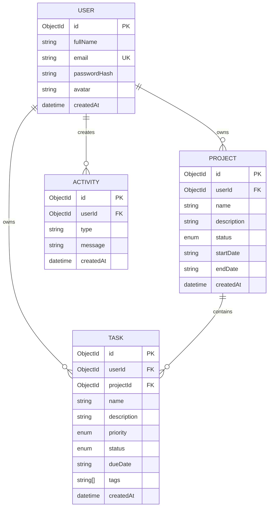

# Data Model

The current implementation uses MongoDB/Mongoose. This diagram documents the current submission state; the assessment brief asks for PostgreSQL or MySQL, so migrating these relationships to a relational database remains a rubric gap.

